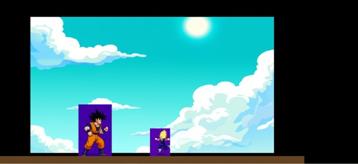

# 2D Game Builder Platform

## Project Summary

This platform lets anyone create a custom 2D browser game by simply describing it in plain English. The system uses AI to generate a game blueprint, assets, and code, then assembles a playable game. Users can view, play, and modify all their games from a central dashboard. Each game is stored in its own folder and can be edited or updated anytime.

## Tech Stack

- **Frontend:** React, TailwindCSS
- **Game Engine:** Phaser.js
- **Backend:** FastAPI (Python), Google Gemini (AI)
- **Asset Generation:** Google Gemini Image Generation

## Project Structure

### Permanent (Core Platform)

- `src/` (React frontend, UI components, pages, engine modules)
- `BE/main.py` (FastAPI backend, API endpoints)
- `BE/services/` (AI, storage, asset generation logic)
- `BE/requirements.txt` (Backend dependencies)

### Dynamic (Per Game)

- `BE/games/<game_name>/`
  - `blueprint.json` (Game design, generated per game)
  - `production_plan.json` (Detailed plan, generated per game)
  - `phaser/` (Game engine files, generated per game)
  - `assets/` (Sprites, backgrounds, effects, UI images)

## Setup Instructions

### 1. Backend (BE)

- **Requirements:** Python 3.10+
- **Install dependencies:**

  ```bash
  cd BE
  python -m venv myenv
  myenv\Scripts\activate
  pip install -r requirements.txt
  ```

- **Run backend server:**

  ```bash
  uvicorn main:app --reload
  ```
  
  ```bash
  ⚠️ Important: Don't forget to set up your Gemini API key in BE/services/gemini.py!
  ```
  
### 2. Frontend (FE)

- **Requirements:** Node.js (v16+ recommended), npm
- **Install dependencies:**

    ```bash
  cd FE
  npm install
  npm install phaser
  npm install phaser tailwindcss
  npm install -D tailwindcss postcss autoprefixer
  npx tailwindcss init
  ```

- **Run frontend dev server:**

  ```bash
  npm start
  ```


## UI Screenshots


- HOME SCREEN:


- MODIFY GAME ASSETS POP-UP:


- GAMEPLAY SCENES:




---

- The frontend runs on [http://localhost:3000](http://localhost:3000)
- The backend runs on [http://localhost:8000](http://localhost:8000)
- Every game gets generated and stored in `BE/games/`.
